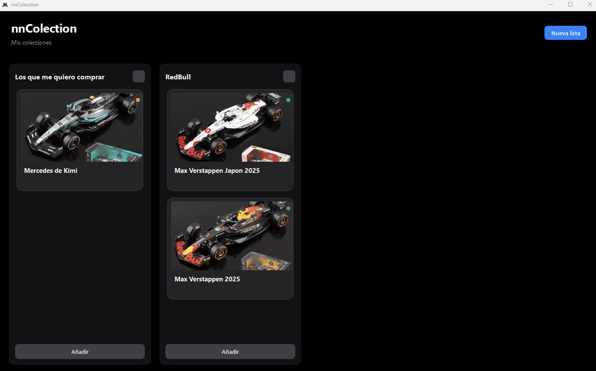

# Tablero nnColection

Un fin de semana estaba aburrido y tenía ganas de practicar Python, así que me puse a armar este programa. Como colecciono autos a escala, quería tener un lugar donde organizar los que ya tengo separados por marca y los que me quiero ir comprando.

De paso lo adapté para que también sirva como una lista de deseos general para guardar cosas de Amazon, AliExpress o MercadoLibre con sus links directos. Es un proyecto de pasatiempo, pero lo comparto en mi portafolio porque le puede servir a alguien más.

## Tecnologías utilizadas

* **Python 3**
* **PySide6:** Framework principal para la construcción de la interfaz gráfica de usuario.
* **SQLite3:** Base de datos relacional ligera para el almacenamiento persistente y estructurado de la información local.
* **PyInstaller:** Herramienta de empaquetado para distribuir la aplicación como un ejecutable portable .exe sin requerir dependencias en el entorno del usuario final.

## Características principales

* **Interfaz:** Organización visual mediante listas y tarjetas totalmente personalizadas, construida con una arquitectura de componentes modulares
* **Drag and drop:** Lógica implementada para arrastrar y soltar tarjetas fluidamente entre diferentes listas, actualizando el orden y la relación en la base de datos en tiempo real.
* **Diseño:** Implementación de un dark mode estético mediante hojas de estilo CSS/QSS inyectadas dinámicamente
* **Gestor:** Carga de imágenes locales mediante el sistema de archivos del SO (copia segura a una ruta de almacenamiento de la app) e integración con un módulo para redirigir al usuario al navegador web directamente desde las tarjetas de artículos.
* **Persistencia:** La base de datos y los recursos visuales se generan automáticamente en el directorio temporal seguro de Windows (AppData/Local/), permitiendo que el software funcione de manera portable "plug and play" sin configuraciones adicionales para el usuario final.

## Instalación y uso

Les deje el .exe portable en releases
https://github.com/cristianmoyadev/tablero-gestion-articulo/releases/tag/v1.0.0